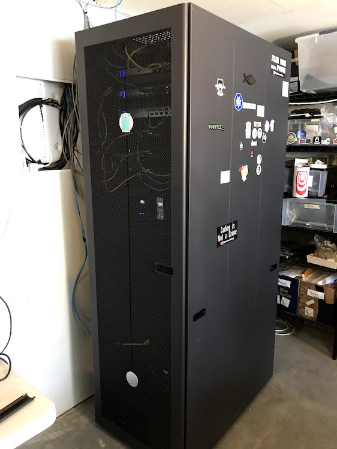
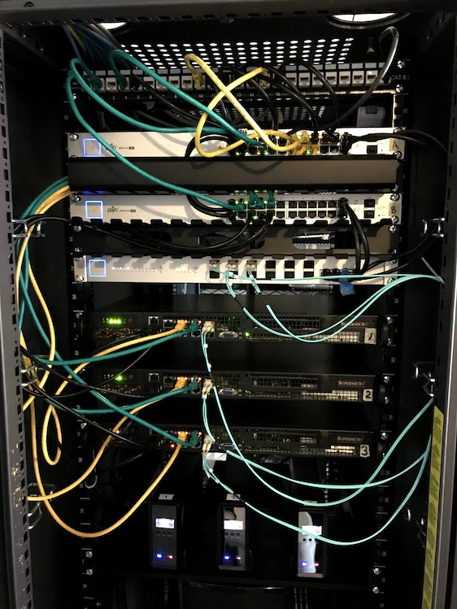
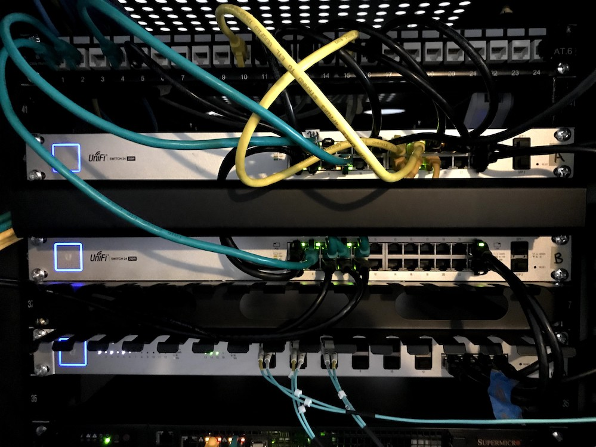
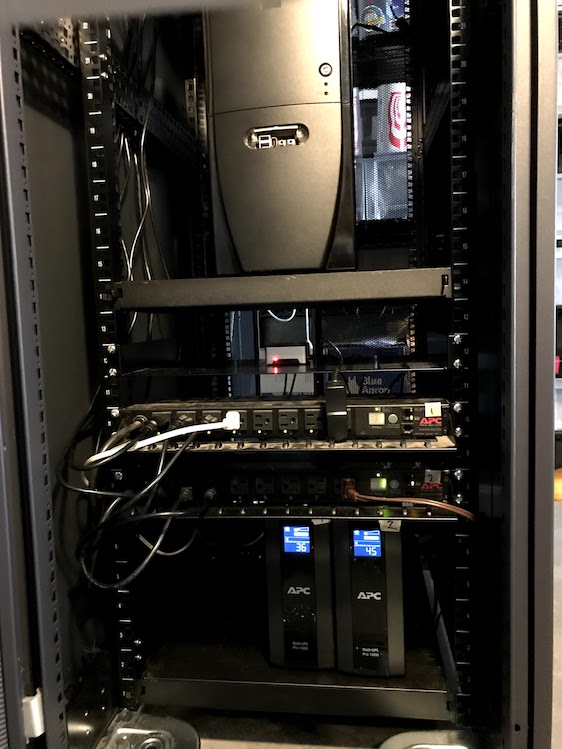

# Brad's Homelab

Hi, I'm [Brad](https://bradfitz.com), @bradfitz [on Twitter](https://twitter.com/bradfitz), etc.

This page describes my home server & networking setup.

# Goals

The primary goals of this project are...

* to have a highly-available home Internet setup, with no SPOF (Single Point of Failure)

* to learn and have fun.

# In summary

I have 3 physical machines plugged into 3 switches, with all switches
connected to each other. I don't have a physical
router/gateway. Instead, a Linux virtual machine handles the IPv4 NAT,
IPv6 announcements, DHCP, DNS, etc, and that Linux VM floats between
the 3 VMs as needed, including live migration during maintenance.

My 4 Wifi APs are PoE-powered from the two switches. I have two ISPs.

I have two UPSes and two PDUs powering separate halves of the gear,
and separate ISPs, giving me about 35-45 minutes of runtime (and thus
Internet) during a power outage. The whole house might be dark, but the
battery-powered wifi will work.

# In photos

Higher quality photos at [https://photos.app.goo.gl/Y5Ah6AeGekVkf3tY9](https://photos.app.goo.gl/Y5Ah6AeGekVkf3tY9).

# Gear

## Servers

* 3 x [Supermicro SYS-5018D-FN8T](https://www.supermicro.com/products/system/1u/5018/SYS-5018D-FN8T.cfm)
  * 64 GB RAM (2 x 32GB DDR4 PC4-19200 2400MHz 288p RDIMM), leaving room to double RAM later
  * boot/OS disk: 64 GB SATA DOM ([SSD-DM064-SMCMVN1](https://www.supermicro.com/products/nfo/SATADOM.cfm))
  * SSD 1: Samsung SSD 850 EVO 500GB
  * SSD 2: Samsung SSD 860 EVO 1TB
  * HDD, external: 8000 GB [HGST HUH728080ALE600](https://www.amazon.com/gp/product/B00NP6AOCK)

## Switches

* 2 x [UniFi Switch 24 PoE-250W](https://www.ubnt.com/unifi-switching/unifi-switch-poe/): 24x Power-over-Ethernet 1Gbps ports
* 1 x [UniFi Switch 16 XG](https://www.ubnt.com/unifi-switching/unifi-switch-16-xg/): 10Gbps Aggregation Switch, primarily for Ceph (but part of same LAN). I only have one of these, but if it fails the Linux bond fails over to the 1Gbps switches.

## Wi-Fi APs

* 2 x [UniFi AP-AC-Pro](https://www.ubnt.com/unifi/unifi-ap-ac-pro/)
* 2 x [UniFi AP-AC-In Wall](https://inwall.ubnt.com/)

## Power

The whole setup including all APs and switches draws about 220 watts
idle. Power is pretty cheap in Seattle. Washington State (as of April
2018) has the cheapest electricity in the United States, at
$0.0974/kWh.

* 2 x [APC Back-UPS Pro 1000 BR1000G](https://www.amazon.com/APC-Back-UPS-Battery-Protector-BR1000G/dp/B0038ZTZ3W)
* 2 x [APC AP7801 Rack PDU](https://www.amazon.com/gp/product/B004Y39T7Y/)

## ISPs

* [CenturyLink Fiber](https://www.centurylink.com/fiber/plans-and-pricing/seattle-washington/), gigabit, primary ISP.
* [Atlas Networks](http://www.gigabitseattle.com/), my backup ISP: a ~100Mbps radio link, using a [Unifi NanoBeam AC](https://www.ubnt.com/airmax/nanobeam-ac-gen2/).

# Software

* [Proxmox VE](https://www.proxmox.com/en/) is the Debian-based base OS on the servers, and Proxmox is a nice UI for managing qemu VMs and Ceph. I previously tried VMware for about a year, both are [annoying in different ways](https://twitter.com/bradfitz/status/1000087524876800000). Proxmox might be a little rough in places, but I prefer it.
* [Ceph](https://ceph.com/) for storage. I love Ceph so much and discovering it makes this whole adventure worth it. Still much to learn, though.
* [ISC DHCP](https://www.isc.org/downloads/dhcp/) for the DHCP server. I auto-generate its config from a Go program that has a map of most my important devices' MAC addresses.
* [CoreDNS](https://coredns.io/) for the DNS server on the gateway VM, which lets me encrypt all upstream DNS so ISPs can't see or mess with it. (even though they can see IPs and SNI)
* [tcpproxy](https://github.com/google/tcpproxy) that [Dave Anderson](https://github.com/danderson) and I wrote. I use it on an HA VM to route ingress traffic to various VMs & services.

# Config

## Network config

* The LAN is `10.0.0.0/16`.
* Untrusted VLAN is `10.2.0.0/16`, which the LAN can connect to, but the untrusted machines can't initiate connections back out to.
* Gateway, DHCP at `10.0.0.1` (and `10.2.0.1` for untrusted)
* DHCP range is `10.0.100-199.x` so they're easy to recognize. Likewise for the untrusted VLAN.
* Networking gear have static IPs `10.0.6.x` (6 is above the letter `N` on the keyboard, which is how I map letters to numbers usually)
* ...

## Proxmox/host config

...

## Device config

...

## Firewall config

* [Ferm](http://ferm.foo-projects.org/) for simplifying writing iptables rules

# Monitoring

* Not enough yet. WIP. Plan is to use Prometheus more.
* A Raspberry Pi has USB connections to the two UPSes.

# Home Automation

* [Home Assistant](https://www.home-assistant.io/) running in an HA VM. It does ZWave using...
* ... [remserial](https://github.com/hunterli/remserial) to let me move a serial device across the network to ...
* ... a stateless Raspberry Pi with an [Aeotec Z-Stick Gen5](https://www.amazon.com/Aeotec-Z-Stick-Z-Wave-create-gateway/dp/B00X0AWA6E/).

# Testing

TODO: link to program with dependency graph of all devices, services,
and connections, and to simulate failures to validate there are no
hidden SPOFs.

# Past failures

* I used to use a [Soekris net6501](http://www.soekris.com/products/net6501-1.html) as my home gateway, but its CPU maxes out NAT'ing about 300 Mbps, sadly, so I started looking at alternatives when I got Centurylink fiber.
* A truck once clipped the fiber running to our house. It's nice having a second WAN link.
* I used to use a [UniFi Security Gateway Pro](https://www.ubnt.com/unifi-routing/unifi-security-gateway-pro-4/) but it failed one day and wouldn't power on any more. [Dave](https://github.com/danderson) had a backup for me handy, but the Unifi controller software wedged itself and wouldn't let me remove the old (dead) one and thus I couldn't add the new replacement, since you can only have one gateway in a site at a time. I [was not amused](https://twitter.com/bradfitz/status/966756630787383296), and that was the final straw that made me realize I wanted a highly-available setup.
* I used to use VMware with highly-available vCenter setup, but the whole thing was felt bloated and slow and enterprisey, and I couldn't stand the Flash UI, which was still required for many operations. That's increasingly going away and being replaced with HTML5, but I also couldn't stand the VMware enterprise-targeted documentation. And I wanted to use something Open Source, too.

# Thanks

Much thanks to [Dave Anderson](https://github.com/danderson) for
helping with a lot of this. He has a very similar setup at his home
and we enjoy watching each other both succeed and fail at trying new
things.

